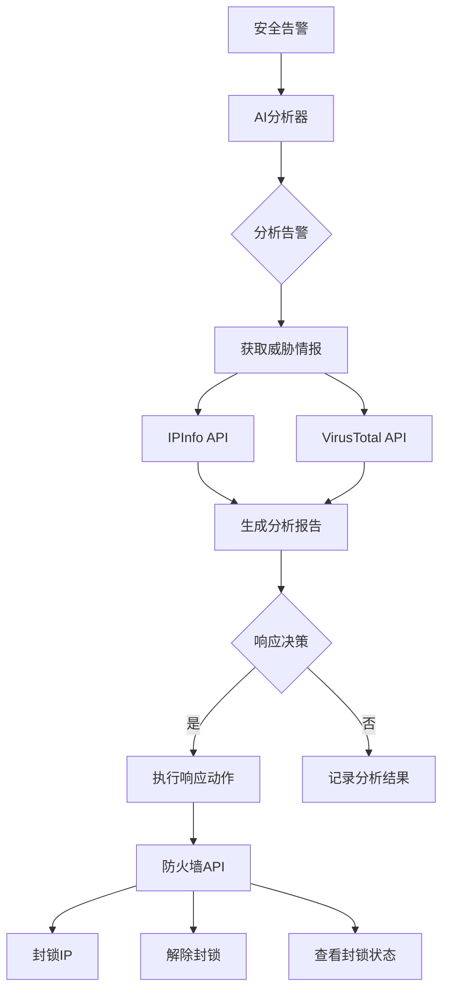
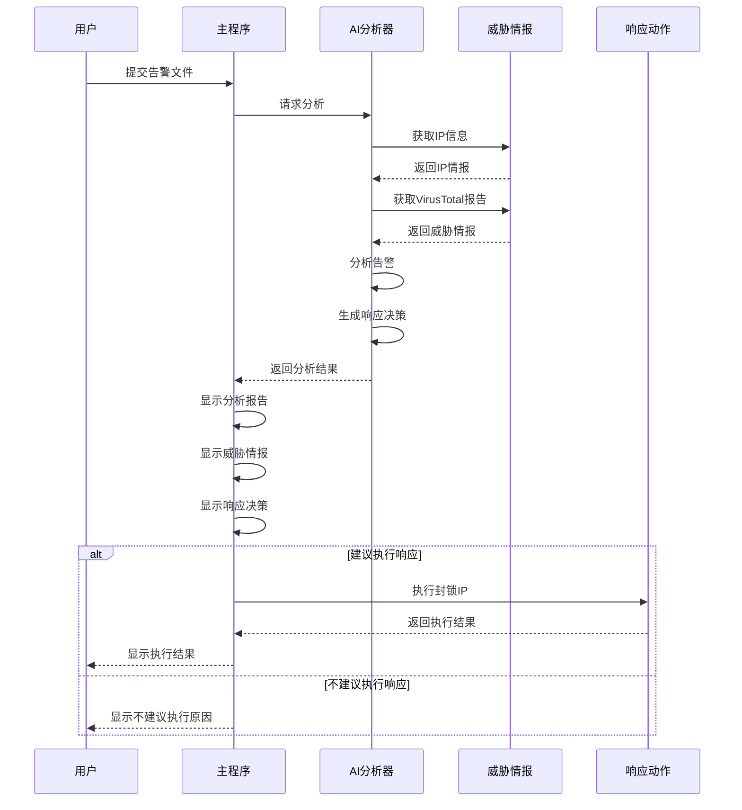

# AI 安全运营助手

这是一个基于通义千问大语言模型的安全运营分析工具，可以自动分析安全告警并提供响应建议。

## 功能特点

- 自动分析安全告警信息
- 集成威胁情报查询（IP信息、VirusTotal）
- 使用通义千问大语言模型进行智能分析
- 提供详细的告警分析报告
- 自动生成响应建议
- 支持自动执行响应动作

## 环境要求

- Python 3.10
- 通义千问 API 密钥
- VirusTotal API 密钥
- IPInfo API 密钥

## 系统架构



## 工作流程



## 安装

1. 克隆仓库：
```bash
git clone https://github.com/yourusername/ai-security-ops-assistant.git
cd ai-security-ops-assistant
```

2. 创建虚拟环境：
```bash
python -m venv .venv
source .venv/bin/activate  # Linux/Mac
.venv\Scripts\activate     # Windows
```

3. 安装依赖：
```bash
pip install -r requirements.txt
```

4. 配置环境变量：
创建 `.env` 文件并添加以下配置：
```
DASHSCOPE_API_KEY=your_dashscope_api_key
VIRUSTOTAL_API_KEY=your_virustotal_api_key
IPINFO_API_KEY=your_ipinfo_api_key
FIREWALL_API_KEY=your_firewall_api_key
```

## 使用方法

```bash
python main.py analyze --alert-file sample_alert.json
```

## 告警文件格式

告警文件应为 JSON 格式，包含以下字段：
```json
{
    "alert_type": "string",
    "timestamp": "string",
    "event": {
        "source": {
            "ip": "string",
            "port": number
        },
        "target": {
            "ip": "string",
            "port": number
        },
        "protocol": "string",
        "description": "string"
    }
}
```

## 分析报告格式

分析报告包含以下内容：
1. 告警概述
2. 威胁等级评估
3. 攻击者分析
4. 影响范围
5. 建议的响应措施
6. 响应决策

## 注意事项

- 请确保 API 密钥配置正确
- 告警文件必须符合指定格式
- 建议在测试环境中先进行验证
- 响应动作执行前请仔细评估风险

## 许可证

MIT License

## 项目结构

- `main.py`: 主程序入口
- `ai_analyzer.py`: AI分析服务
- `threat_intel.py`: 威胁情报服务
- `response_actions.py`: 响应动作服务
- `config.py`: 配置文件
- `sample_alert.json`: 示例告警文件

## 依赖

- Python 3.10
- DashScope (通义千问)
- Typer
- Rich
- Requests
